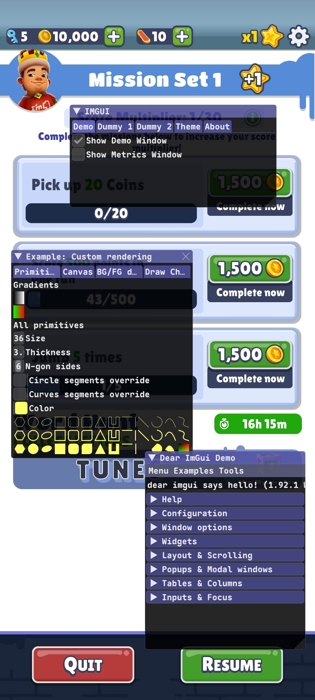

# ImGui Android Example

## ✨

- 🔧 Hook to OpenGL ES 3 via `eglSwapBuffers`
- 🔍 Direct touch input from `libinput.so`
- 🧩 Hooking support via [Dobby](https://github.com/jmpews/Dobby) dan [xDL](https://github.com/hexhacking/xDL)

## 🧰

- [Dear ImGui](https://github.com/ocornut/imgui) – Instant GUI
- [Dobby Hook](https://github.com/jmpews/Dobby) – Lightweight dynamic/instrumentation hook
- [xDL](https://github.com/hexhacking/xDL) – Helper for dynamic symbol resolve on Android
